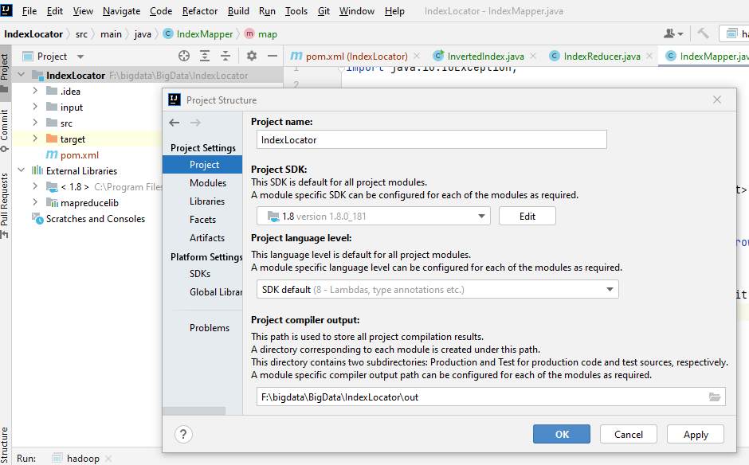
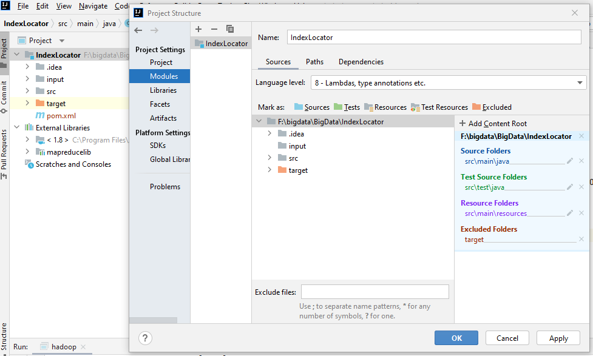
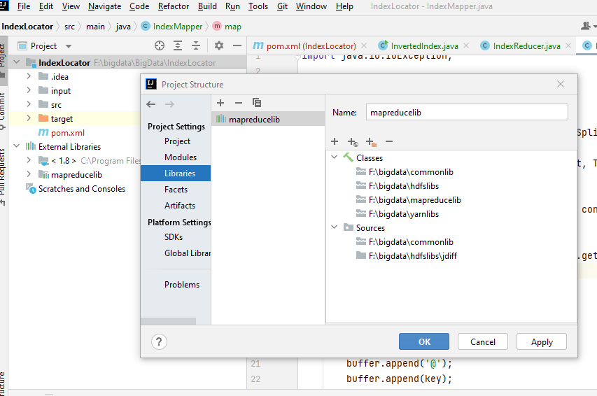
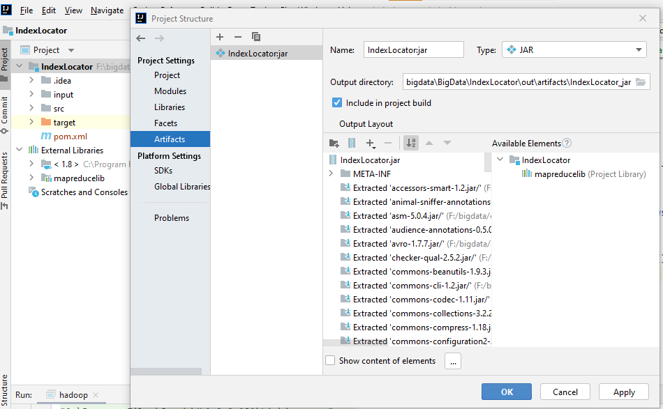
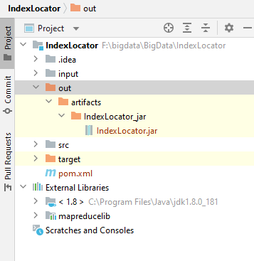

## HDFS and HADOOP

First check how many nodes are running 

    > hadoop dfsadmin -report
    
    WARNING: Use of this script to execute dfsadmin is deprecated.
    WARNING: Attempting to execute replacement "hdfs dfsadmin" instead.
    
    Configured Capacity: 0 (0 B)
    Present Capacity: 0 (0 B)
    DFS Remaining: 0 (0 B)
    DFS Used: 0 (0 B)
    DFS Used%: 0.00%
    Replicated Blocks:
    Under replicated blocks: 0
    Blocks with corrupt replicas: 0
    Missing blocks: 0
    Missing blocks (with replication factor 1): 0
    Low redundancy blocks with highest priority to recover: 0
    Pending deletion blocks: 0
    Erasure Coded Block Groups:
    Low redundancy block groups: 0
    Block groups with corrupt internal blocks: 0
    Missing block groups: 0
    Low redundancy blocks with highest priority to recover: 0
    Pending deletion blocks: 0
    
    ------------------------------------------------- 

Check ports 

    >netstat -ntlp

    Active Internet connections (only servers)
    Proto Recv-Q Send-Q Local Address           Foreign Address         State       PID/Program name
    tcp        0      0 127.0.0.1:9000          0.0.0.0:*               LISTEN      274/java
    tcp        0      0 127.0.0.1:3306          0.0.0.0:*               LISTEN      -
    tcp        0      0 0.0.0.0:9868            0.0.0.0:*               LISTEN      600/java
    tcp        0      0 0.0.0.0:9870            0.0.0.0:*               LISTEN      274/java
    tcp        0      0 0.0.0.0:22              0.0.0.0:*               LISTEN      15/sshd
    tcp6       0      0 :::22                   :::*                    LISTEN      15/sshd

##  HttpFS server, the HDFS HTTP Gateway 

	> hdfs httpfs

## Clean the name 

	sudo rm -R /tmp/*

format the namenode

	hdfs namenode -format

## IDE setup for a hadoop project 

Project setup

modules 

libraries 

artifacts 

JDK 

output jar 

## IDE to docker container hosting haddop 

 	docker cp .\IndexLocator\out\artifacts\IndexLocator_jar\IndexLocator.jar bda:/hadoop-data

## Elastic MapReduce (EMR)

 1: Develop a MapReduce Java Program

 2 : AWs account creation 

 3 : Upload the JAR and input files to Amazon S3

 4: Run an elastic MapReduce job

- Go to the Elastic MapReduce (EMR) service in AWS. From the control panel there, click the “Create cluster” button.
- on the first configuration screen, click “Go to advanced options”
- On the “Step 1: Software and Steps” page (“Software Configuration”)
	- Select Release “emr-6.5.0”. Leave all the default services checked
	- Under “Steps (optional)”, do the following things
		Check “Cluster auto-terminates” for the item “After last step completes”.
		Choose “Step type” as “Custom JAR” – provide name , location and arguments from s3
	- after being done configuring the Custom JAR, click “Add”.
- On the “Step 2: Hardware” page (Hardware Configuration),
	- instance m5.xlarge is one of the Amazon EC2 instances
	- select master node , worker ( core ) nodes and atsks 
- on "Step 3: General Cluster Settings” page (General Options), give your cluster a name.
- On the “Step 4: Security” page (Security Options , give a key pair

## Debugging

**Issue1** space issues 

**solution** check free space available

 	> free -m
        total        used        free      shared  buff/cache   available
	Mem:           6265        1407        2788         366        2069        4213
	Swap:          2048           0        2048

	> hdfs dfs -df
	Filesystem             Size  Used  Available  Use%
	hdfs://localhost:9000     0     0          0  NaN%

**Issue2** safe mode probnlems 

	# hadoop fs -mkdir /exercise/reviews
	mkdir: Cannot create directory /exercise/reviews. Name node is in safe mode.

**Solution** CHECK THE name node status

	> hdfs dfsadmin -safemode get
	Safe mode is ON

Leave the safe mode 

	> hdfs dfsadmin -safemode leave
	Safe mode is OFF

Enter in SAFE MODE:

	> hdfs dfsadmin -safemode enter

**Issue 3** Corrupted spaces 

**solution** For corrupted blocks, you can have a look at output of this command:

	hdfs fsck -list-corruptfileblocks

And try to delete corrupted blocks using:

	hdfs fsck / -delete

**Issue 4** IO Exception in put 

	._COPYING_ could only be written to 0 of the 1 minReplication nodes. There are 0 datanode(s) running and 0 node(s) are excluded in this operation.

**solution** check the configuration of master and slave nmodes 

	> cat /etc/hosts

	127.0.0.1       localhost
	::1     localhost ip6-localhost ip6-loopback
	fe00::0 ip6-localnet
	ff00::0 ip6-mcastprefix
	ff02::1 ip6-allnodes
	ff02::2 ip6-allrouters
	172.17.0.2      2e2f6c19ed60

If none found than stop and start data nodes
	> /opt/hadoop-3.2.1/sbin/stop-all.sh

	Stopping namenodes on [localhost]
	Stopping datanodes
	Stopping secondary namenodes [2e2f6c19ed60]
	Stopping nodemanagers
	Stopping resourcemanager

	> /opt/hadoop-3.2.1/sbin/start-dfs.sh

	Starting namenodes on [localhost]
	Starting datanodes
	Starting secondary namenodes [2e2f6c19ed60]

Alternayively you can start data node using hdfs 

	> hdfs --daemon start datanode 

**Issue 5** Incom[atiable clusyter Id 

	2022-04-17 18:00:33,442 WARN common.Storage: Failed to add storage directory [DISK]file:/tmp/hadoop-root/dfs/data
java.io.IOException: Incompatible clusterIDs in /tmp/hadoop-root/dfs/data: namenode clusterID = CID-01feef3c-4682-41cb-a90c-7e0f53eabffb; datanode clusterID = CID-c806df05-af30-4945-9c97-d14c0cda1ab3

**solution** 
