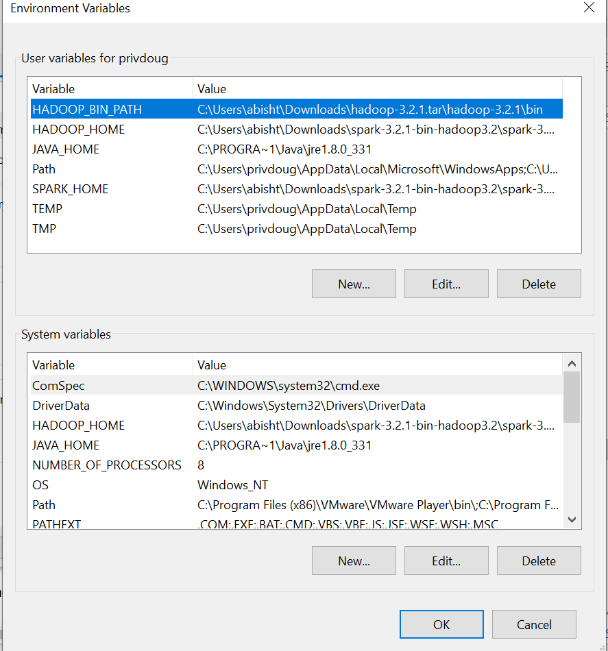
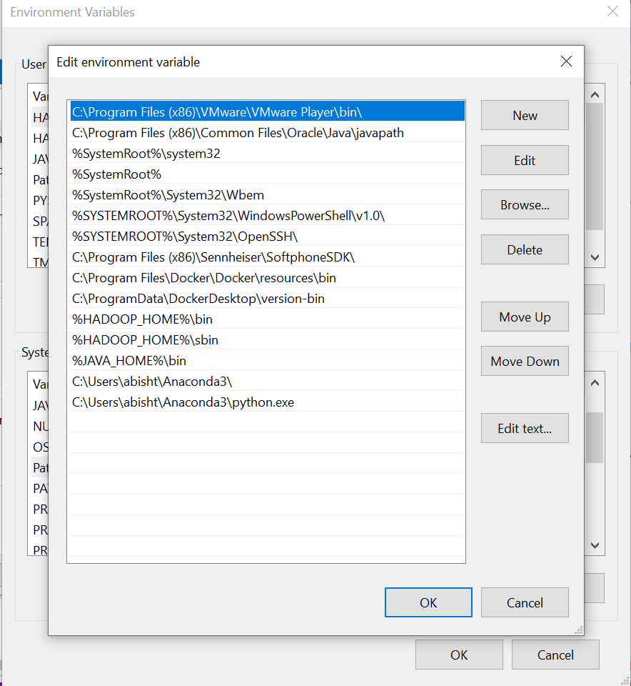
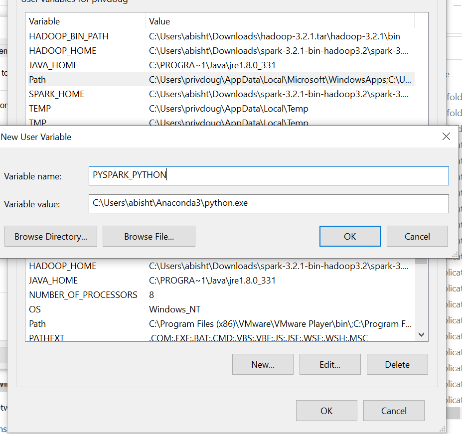

# web server log analysis with Apache Spark

Log data comes from many sources, such as web, file, and compute servers, application logs, user-generated content. 
Logs can be used for monitoring servers, improving business and customer intelligence, building recommendation systems, fraud detection, and much more.

# Spark processing for csv files 

	cd "C:\Users\abisht\OneDrive - Seattle University\Documents\GitHub\BigData\sparkproj"

	C:\Users\abisht\Anaconda3\python.exe

## pyspark 

Download tar from https://www.apache.org/dyn/closer.lua/spark/spark-3.2.1
Extract 
Add env variables 

	SPARK_HOME  = C:\Users\abisht\Downloads\spark-3.2.1-bin-hadoop3.2\spark-3.2.1-bin-hadoop3.2
	HADOOP_HOME = C:\Users\abisht\Downloads\spark-3.2.1-bin-hadoop3.2\spark-3.2.1-bin-hadoop3.2
	PATH=%PATH%;C:\Users\abisht\Downloads\spark-3.2.1-bin-hadoop3.2\spark-3.2.1-bin-hadoop3.2\bin

spark hadoop env varaibles

### RDD resilient distributed dataset

Collection of elements partitioned across the nodes of the cluster that can be operated on in parallel

RDD from colections 

	

## Debugging help 

**Issue1** Not finding haddop home set 

	java.io.FileNotFoundException: java.io.FileNotFoundException: HADOOP_HOME and hadoop.home.dir are unset. -see https://wiki.apache.org/hadoop/WindowsProblems

**solution** set the haddop home in the terminal 

	set HADOOP_HOME='C:\Users\abisht\Downloads\hadoop-3.2.1.tar\hadoop-3.2.1\bin'

**Issue2** pyspark doesnt run with 

	Missing Python executable 'python3', defaulting to 'C:\Users\abisht\Anaconda3\Lib\site-packages\pyspark\bin\..' for SPARK_HOME environment variable. 
	Please install Python or specify the correct Python executable in PYSPARK_DRIVER_PYTHON or PYSPARK_PYTHON environment variable to detect SPARK_HOME safely.
	
**Solution** set spark home env varaible 

	set SPARK_HOME=C:\Users\abisht\Downloads\spark-3.2.1-bin-hadoop3.2\spark-3.2.1-bin-hadoop3.2

**Issue 3** python unspecified

	ERROR Executor: Exception in task 0.0 in stage 0.0 (TID 0)/ 1]
	java.io.IOException: Cannot run program "python3": CreateProcess error=2, The system cannot find the file specified

**Solution** set the python exe in system path 

**Issue4** 

	Missing Python executable 'python3', defaulting to 'C:\Users\abisht\Anaconda3\Scripts\..' for SPARK_HOME environment variable. 
	Please install Python or specify the correct Python executable in PYSPARK_DRIVER_PYTHON or PYSPARK_PYTHON environment variable to detect SPARK_HOME safely.

**Solution** set env for PYSPRK_PYTHON such as C:\Users\abisht\Anaconda3\python.exe

**Issue5** warning 

	UserWarning: mkl-service package failed to import, therefore Intel(R) MKL initialization ensuring its correct out-of-the box operation under condition when Gnu OpenMP had already been loaded by Python process is not assured. 
	Please install mkl-service package, see http://github.com/IntelPython/mkl-service